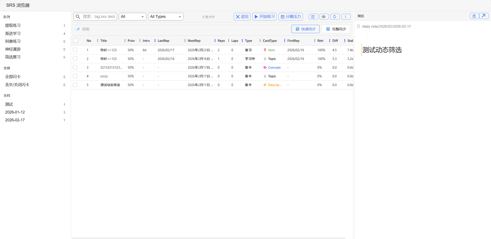
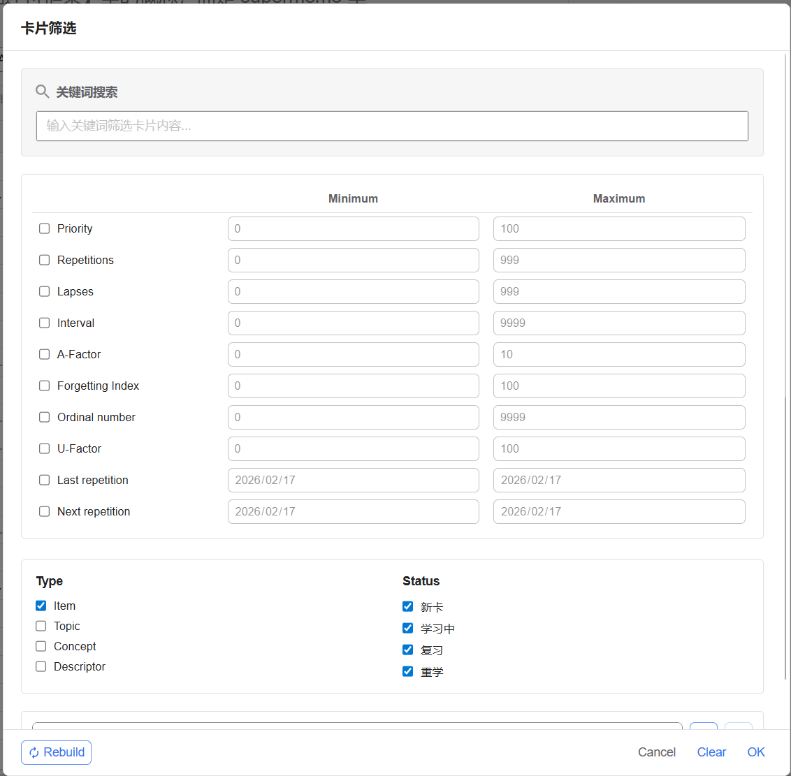
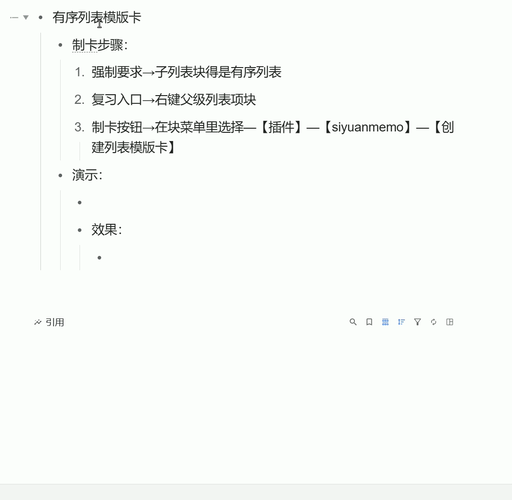
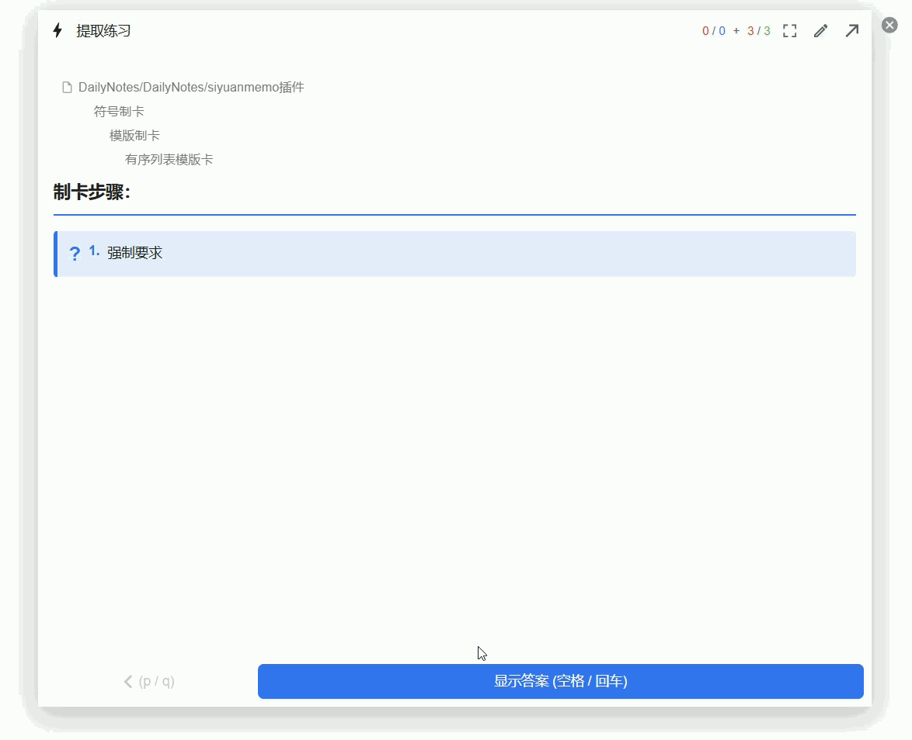
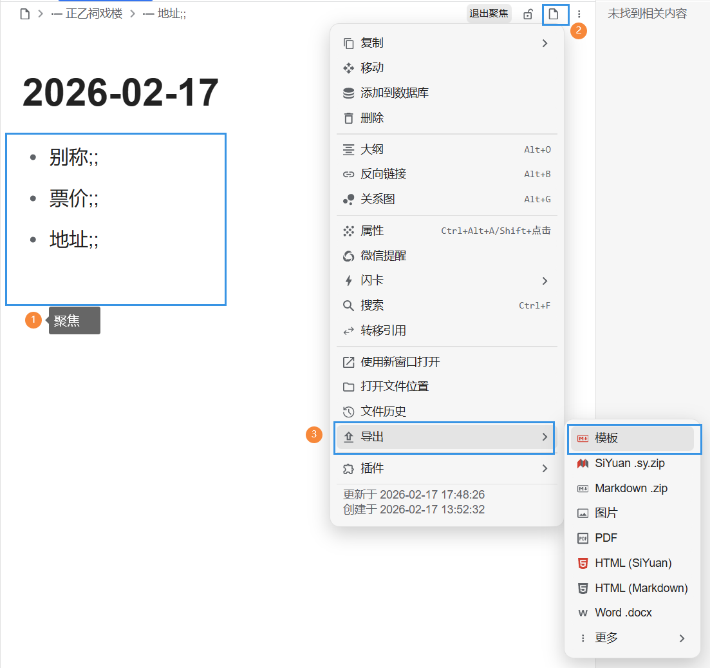
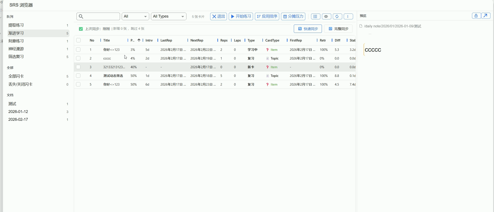
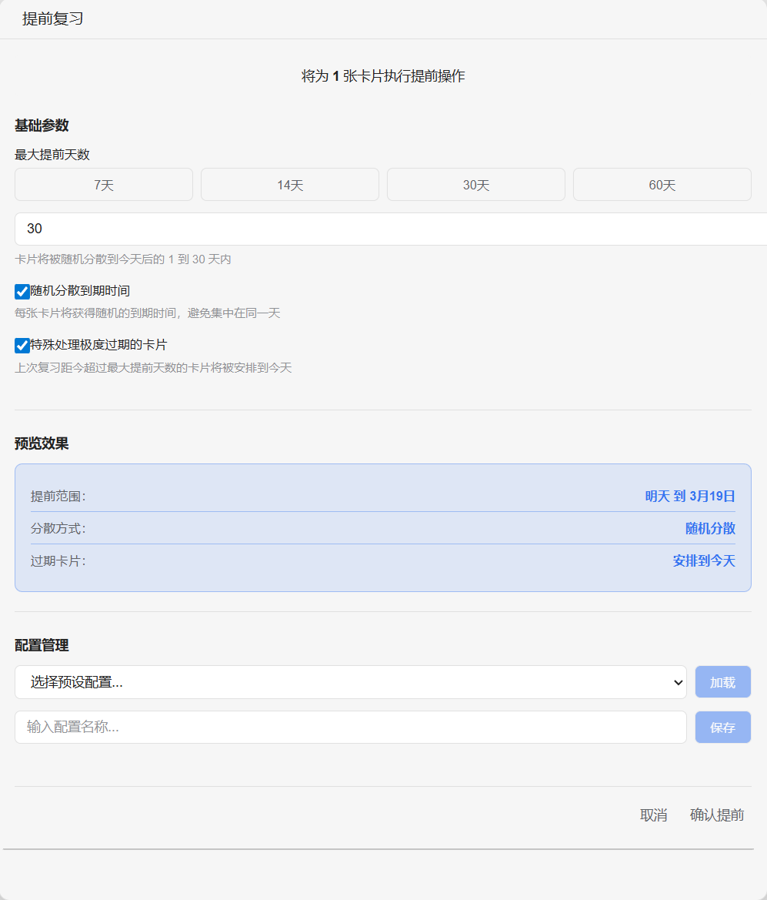
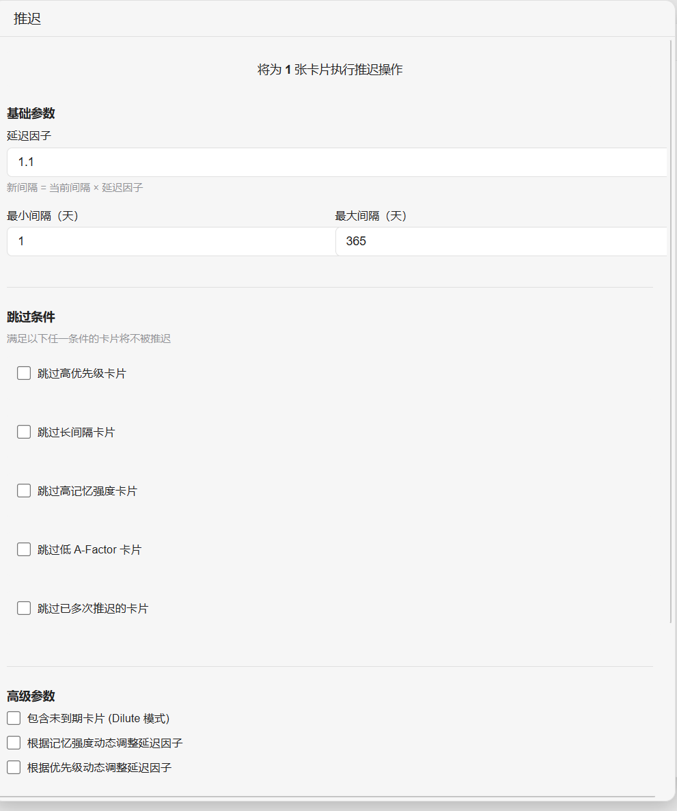
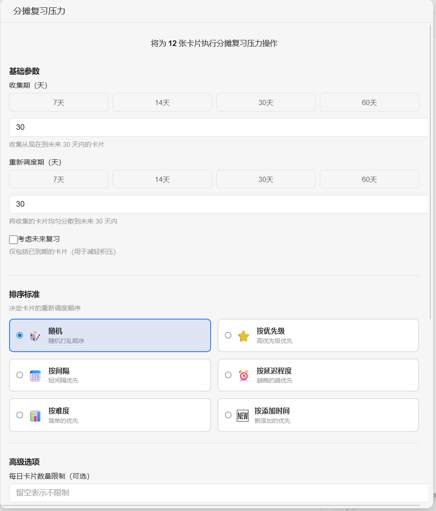

这个插件完善了思源的间隔重复系统，在思源刚要做闪卡时，我心里有过相关的想法，现在时机成熟先做了出来。

这个插件刚到达闪卡的第二阶段，还有很多需要完善，它主要有这些功能：

# SRS 浏览器

- 右侧是预览区，会预览闪卡对应的块，默认锁定，双击解锁。
- 左下角是文档区，会展示所有闪卡的所在的文档块，它会跟着搜索结果、条件筛选、当前队列进行聚焦，辅助管理闪卡。
- 左上角是队列区，点进队列会展示对应队列里的闪卡，可以右键进行管理，包括移除、排序、推迟、提前。

# 四种闪卡

## 练习（Item 卡）：

- 解释：广义上的闪卡。正面提问，背面回答。这是最纯粹的提取练习。
- 如何制作？

  - 在插件里，自动制卡后，有背面问题的会被自动识别为 item。

    - 自动制卡包括：

      - 思源原生的快速制卡
      - 插件的模版制卡
      - 插件的符号制卡
  - 也可以在浏览器里手动标记卡片类型为 item。

## 材料（Topic 卡）：

- 解释：阅读材料。
- 如何制作？

  - 自动制卡后，没有背面问题的卡会被识别为 topic，也可以在浏览器里手动标记。

## 定义（Descriptor 卡、描述符卡 **）** ：

- 解释：

  - 简单来说，它是【模版制卡】，我最早在叶哥写的[【随笔】间隔重复软件的两大进路](https://zhuanlan.zhihu.com/p/396445859)里见到过。
  - 它源自 RemNote 的 **CDF** (Concept/Descriptor Framework，概念描述符框架)。这是一种高度形式化的知识拆解工具。
- 本质：

  - 不仅是为了填表方便（实现 SuperTag） **，** 它还是一种“注意力编程”，引入一种专家视角。就像 AI 的 Prompt 一样，专家通过 CDF 中的 Descriptor 指导你的注意力，让你识别信息中有用的部分。相当于戴上了一个人格面具，复用专家的经验。
  - 对于在校学生，这种形式化（结构化）的工具很方便。
- 如何制作？

  - 需要按照传递型双链的写法来做，在下文有演示。

## 概念（Concept 卡）：

- 解释：

  - 它不是 CDF 【概念/描述符框架】里的概念，而是 supermemo 里的用来【神经复习】的概念。在这个插件里，概念是【神经漫游】队列的核心节点。
- 对应双链，概念卡就是思源里的文档块。
- 如何制作？

  - 点击文档块块标，可以看到这两个按钮：

    - 制作为概念卡并加入队列
    - 制作为概念卡并立即漫游

# 五种队列

## 三种动态队列

### 提取练习

- 队列卡片来源：

  - 获取当天到期和手动加入队列的 item 和 descriptor
- 算法：

  - 使用 FSRS 算法驱动。

### 渐进学习

- 队列卡片来源：

  - 获取当天到期和手动加入队列的所有类型卡
- 算法：

  - item 和 descriptor 使用 FSRS 算法驱动，topic 和 concept 使用另一种算法驱动。

### 筛选复习

- 队列卡片来源：

  - 根据筛选条件获取卡片到队列进行复习，正常评分会移除卡片，点【Rebuild】会重新获取卡片到队列。
  - 
- 算法：

  - item 和 descriptor 使用 FSRS 算法驱动，topic 和 concept 使用另一种算法驱动。

## 一种静态队列——【刻意练习】

- 设计来源：其实应该叫【最终演练】，来自 supermemo 的 finaldrill。
- 队列卡片来源：

  1. 提取练习、渐进学习、筛选复习队列里，评分小于 3 的卡片会自动掉入【刻意练习】队列。
  2. 在浏览器里手动选择闪卡加入。
- 算法：

  - 评分不影响间隔重复排期，在这个队列里，只有评分等于 4 的闪卡才会移除队列，如果一直按评分 3 的话，会永远刷不完。
  - 队列排序使用了局部洗牌算法，详情看[Final drill algorithm](https://supermemopedia.com/wiki/Final_drill_algorithm)。

## 一种不知道如何分类的队列——神经漫游

- 设计来源：思源的双链和 supermemo 的神经复习
- 队列卡片来源：漫游的对象是思源的块，这个队列会自动获取概念卡的反链、描述符卡进行漫游。
- 算法：扩散激活。
- 小提示：在漫游的时候，遇到块引用锚文本可以右键——制作为概念卡并加入队列，这样概念卡的正链也能加入队列，进行漫游。逻辑是这样的：

  - 正链=正文中对其它概念（文档块）的引用
  - 反链=正文
  - 正链=反链中对其它概念的引用
  - 

# 快速制卡

## 符号制卡

- 监听了符号，能快速制卡，支持：

  - ​`>>`

    - 正向卡片
    - 问题`>>`答案
  - ​`<<`

    - 反向卡片
    - 答案`<<`问题
  - ​`<>`

    - 双向卡片
    - 术语`<>`定义
    - 会生成两张卡
  - ​`;;`

    - 描述符卡片
    - 属性`;;`描述
  - ​`==挖空==`​ `{{挖空}}` 思源标记

    - 挖空卡片
    - 文本`{{填空}} `​或 `==高亮==` 或思源标记（ALT+D）
    - 有多个挖空标记，会生成多张卡
  - 不会监听被``包裹的符号，输入完符号后，需要回车一下，失去块焦点才会触发自动制卡。

## 模版制卡

有序列表模版，会批量制卡片，共用同一个块 ID，每个卡片可以写单独的问题补充、提示。

- 制卡步骤：

  1. 强制要求→子列表块得是有序列表
  2. 复习入口→右键父级列表项块
  3. 制卡按钮→在块菜单里选择—【插件】—【siyuanmemo】—【创建列表模版卡】
- 问题补充、提示的写法：

  - 提示→问题
  - 举例，步骤1的`强制要求→子列表块得是有序列表`里：

    - 符号→前面的【强制要求】文本是提示
    - 符号→后面的【子列表块得是有序列表】文本是问题
- 制卡演示：

  - 
- 复习效果：

  - 

模版制卡的一些缺陷，努力改造中：

- 没用思源的编辑器，没有图片显示，也就没有图片制卡，也没有公式制卡

## CDF 制卡

- 如何使用？

  - 在列表大纲里使用传递型双链

    1. 打出列表块
    2. 父级块打上对概念文档块的引用
    3. 子级块使用 `描述符;;文本`，写完后敲个回车会自动识别为描述符卡片制卡，如果检测到父级引用的文档块不是概念卡，会自动将其制作为概念卡
  - 举例：

    - [[中子星]]

      - 定义;;介于白矮星和黑洞之间的极端致密天体
      - *前身*;; **8-30倍** 太阳质量的恒星残留核心
      - *直观密度* ;; **一茶匙** 重达 **10亿吨**
      - *特殊变种* ;; **脉冲星** (Pulsar)
      - *临界点* ;; **奥本海默极限** (超过则坍缩为黑洞)
  - 复习效果：

    - 
- 小技巧：

  - 删除描述符卡：

    - 考虑到稳定性的原因，描述符卡片用的是段落块制卡，如果你要在思源编辑器里删除卡片，需要光标点在对应块里，用 ctrl+/ 唤出段落块的块菜单，然后取消闪卡。
    - 或者直接在 SRS 浏览器里删除。
  - 为你常用的描述符组合建立一个模版吧！

    1. 聚焦到你的描述符组合
    2. 点击右上角文档块块标
    3. 导出-模板
    4. 在对应概念下用块菜单 **/模版**  唤出对应的描述符模版
  - 

# 分离思源的块和闪卡，实现一个块生成多张闪卡

- 普通闪卡还是一个块对应一张卡，双向卡、列表模版卡、多挖空卡则用到了这个机制。

# 闪卡规划

## 排序

- 可以在浏览器里对队列里的闪卡进行排序，排序后应用到队列，复习时的顺序也会变

  - 点击浏览器字段排序
  - 右键排序
  - 演示：

    - 

## 提前

- 在浏览器中，右键卡片选择【提前】，与【推迟】对应
- 

## 推迟

- 在浏览器中，右键卡片选择推迟
- 

## 分摊压力

- 在浏览器的工具栏上会有【分摊压力】按钮，点击会打开界面
- 
- 注意：在全部闪卡下的【分摊压力】功能有两种模式，一种是处理未复习的闪卡，也就是积压（默认不勾选考虑未来复习），另外一种就是会考虑未来一年复习的闪卡，可以通过调整收集期来选中。
- 在队列视图下，点击【分摊压力】会默认收集到期的卡片，无法更改收集期。

